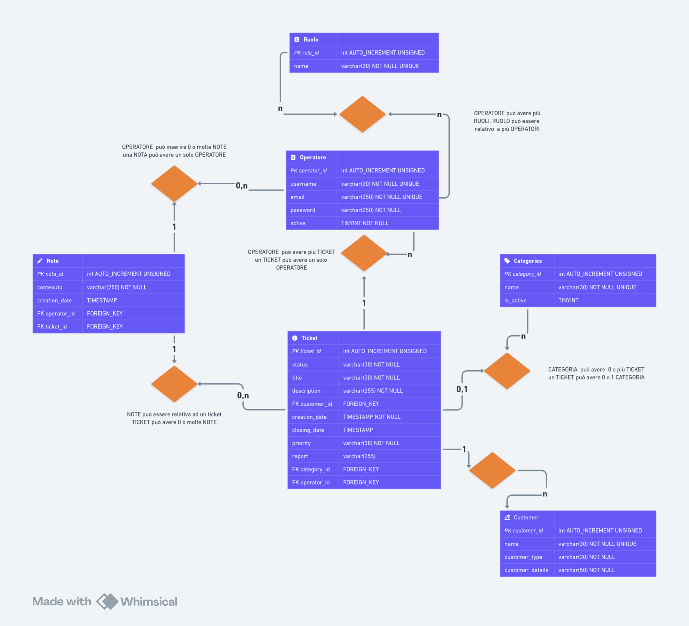

# Milestone 4 - 'ticket-platform'
Il progetto prevede la realizzazione di una backoffice per la piattaforma di gestione delle richieste di supporto al team di assistenza tecnica di un prodotto.
## ER Schema
Di seguito, lo schema ER che rappresenta tutte le entità presenti in database e come sono relazionate fra esse.

